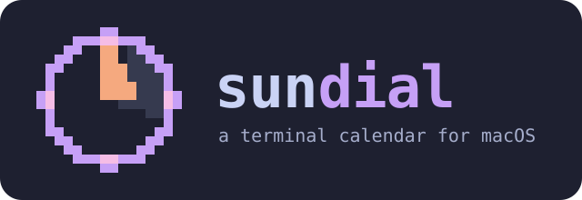

<p align="center">
  
</p>

# sundial

A terminal calendar for macOS. sundial reads the calendars macOS already syncs (iCloud, Google, Exchange, local) and shows them in month, week, and agenda views, with a command palette. Built with [Bubble Tea](https://github.com/charmbracelet/bubbletea) and [Lip Gloss](https://github.com/charmbracelet/lipgloss).

sundial is read-only: it never creates, changes, or deletes events. It makes no network calls and collects no telemetry.


## Requirements

- macOS 14 or later
- Go 1.27+, Xcode command line tools, and [just](https://github.com/casey/just) to build

## Install

```sh
git clone https://github.com/JacobAtchley/sundial
cd sundial
just install
```

This builds sundial and copies it to `~/.local/bin/sundial`. Make sure `~/.local/bin` is on your `PATH`, or pick another folder with `SUNDIAL_BIN_DIR=/some/dir just install`. `just uninstall` removes it.

On first run macOS asks for calendar access for your terminal app. If you decline, enable it later in **System Settings → Privacy & Security → Calendars**.

## Usage

```sh
sundial                      # interactive TUI
sundial today                # today's agenda (plain text when piped)
sundial tomorrow             # tomorrow's agenda
sundial agenda --days 7      # the next week
sundial agenda --json        # machine-readable output
sundial calendars            # calendar titles and IDs
sundial config init          # write a commented starter config
```

The calendar display updates automatically when events change via EventKit notifications, with a 60-second re-check fallback.

### Keys

| Key | Action |
|---|---|
| `m` / `w` / `a` | Month / week / agenda |
| `t` | Today |
| `h` `j` `k` `l` / arrows | Move |
| `[` `]` / `p` `n` | Previous / next period |
| `enter` | Open event (month: agenda for that day) |
| `esc` | Close |
| `/` | Filter the agenda |
| `o` | Open the event's meeting link |
| `ctrl+k` / `:` | Command palette |
| `?` | Help |
| `q` | Quit |

The palette also accepts dates (`fri`, `next mon`, `+3d`, `2026-12-25`) and event titles.

## Configuration

`~/.config/sundial/config.toml` (or `$XDG_CONFIG_HOME/sundial/config.toml`). Every key is optional; run `sundial config init` for a commented template.

```toml
default_view = "agenda"     # month | week | agenda
week_start   = "sunday"     # sunday | monday
time_format  = "12h"        # 12h | 24h
day_start    = 8

[calendars]
hidden = ["Holidays"]

[theme]
pastelize = true
header = "#C6A0F6"

[keys]
palette = ["ctrl+k", ":"]
```

## Privacy

- Event data stays on your machine.
- `--debug` writes a diagnostic log to `~/.local/state/sundial/debug.log`; it never contains event content.

## Development

```sh
just test               # unit + golden tests (fictional data, no calendar access)
just golden             # update golden files after an intentional UI change
just test-integration   # reads your real calendars, logs counts only
just lint
just demo               # run with fictional demo data
just record             # regenerate docs/demo.gif (needs vhs)
```

## License

MIT
